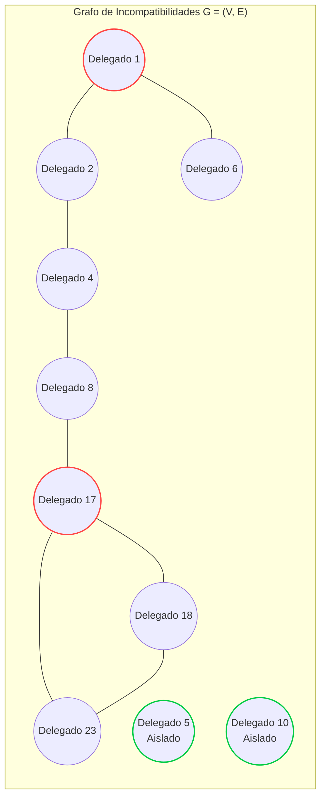

<div align="center">

# 🌐 Organización de Protocolo para Recepciones Internacionales
### *Diplomatic Banquet Protocol Optimization & Table Assignment System*

[](https://en.wikipedia.org/wiki/C_(programming_language))
[](https://www.uc.edu.ve)
[-blue?style=for-the-badge)](https://www.uc.edu.ve)
[](https://en.wikipedia.org/wiki/Graph_coloring)
[](LICENSE)

*Un sistema computacional de alto rendimiento basado en **Teoría de Grafos** y **Coloración de Vértices** para resolver la asignación óptima de delegados internacionales en recepciones oficiales de la ONU (DAGGC).*

</div>

---

## 📌 Tabla de Contenidos
1. [Descripción General y Contexto](#-descripción-general-y-contexto)
2. [Modelado Matemático con Teoría de Grafos](#-modelado-matemático-con-teoría-de-grafos)
3. [Requerimientos del Sistema](#-requerimientos-del-sistema)
4. [Arquitectura de Software y Patrones de Diseño](#-arquitectura-de-software-y-patrones-de-diseño)
5. [Evolución e Ingeniería de Software (2020 vs 2026)](#-evolución-e-ingeniería-de-software-2020-vs-2026)
6. [Estructura del Repositorio](#-estructura-del-repositorio)
7. [Guía de Compilación y Ejecución](#-guía-de-compilación-y-ejecución)
8. [Casos de Prueba y Validación](#-casos-de-prueba-y-validación)
9. [Interfaz de Usuario Visual](#-interfaz-de-usuario-visual)
10. [Licencia y Créditos](#-licencia-y-créditos)

---

## 🏛 Descripción General y Contexto

El **Departamento de la Asamblea General para la Gestión de Conferencias (DAGGC)** de la **Organización de las Naciones Unidas (ONU)** tiene la responsabilidad de organizar cenas y recepciones protocolares diplomáticas entre mandatarios y delegados mundiales.

### El Desafío
* Existen **relaciones rotas u hostiles** entre ciertos países, por lo que delegados incompatibles **no pueden sentarse en la misma mesa**.
* La DAGGC debe distribuir a todos los asistentes utilizando el **menor número posible de mesas** (minimización de recursos).
* No hay restricción en la capacidad máxima de las mesas.
* Para equilibrar el aforo de las mesas, aquellos delegados **libres de conflicto diplomático** (vértices aislados) deben ser agrupados y distribuidos estratégicamente entre las mesas con menor cantidad de comensales (**balanceo de carga**).

Este proyecto modela computacionalmente el problema a través de **Grafos No Dirigidos** y aplica algoritmos de **Coloración de Grafos (Conjuntos Independientes Maximales)** con balanceo voraz (*Greedy Balancing*).

---

## 📐 Modelado Matemático con Teoría de Grafos

El sistema formaliza el problema mediante un grafo simple no dirigido $G = (V, E)$:



* **Vértices ($V$):** Conjunto de $n$ delegados invitados $V = \{1, 2, \dots, n\}$.
* **Aristas ($E$):** Pares $(u, v)$ donde existe una incompatibilidad diplomática mutua.
* **Matriz de Adyacencia ($A \in \{0, 1\}^{n \times n}$):** $A_{ij} = 1 \iff (i, j) \in E$. Permite consultas de incompatibilidad en $\mathcal{O}(1)$.
* **Grado de un Vértice ($\text{deg}(v)$):** Número de incompatibilidades que posee el delegado $v$.
* **Grado Máximo ($\Delta(G)$):** Mayor nivel de conflictividad registrado en el evento.
* **Vértices Aislados ($I = \{v \in V \mid \text{deg}(v) = 0\}$):** Delegados compatibles con todos los asistentes.
* **Número Cromático ($\chi(G)$):** Cantidad mínima de mesas requeridas para ubicar a los delegados sin generar incidentes diplomáticos.

---

## 🎯 Requerimientos del Sistema

| # | Requerimiento | Concepto de Grafos | Complejidad |
|---|---------------|--------------------|-------------|
| **1** | **Consulta de Compatibilidad:** Dados dos delegados $u$ y $v$, determinar si existe conflicto entre ellos. | Adyacencia en Grafo / $A_{u-1, v-1} == 1$ | $\mathcal{O}(1)$ |
| **2** | **Delegados Más Conflictivos:** Identificar el/los delegado(s) con la mayor cantidad de incompatibilidades. | Grado Máximo $\Delta(G) = \max \text{deg}(v)$ | $\mathcal{O}(\|V\|)$ |
| **3** | **Delegados sin Incompatibilidades:** Listar todos los delegados libres de conflicto diplomático. | Vértices Aislados $I = \{v \mid \text{deg}(v) = 0\}$ | $\mathcal{O}(\|V\|)$ |
| **4** | **Distribución Óptima de Mesas con Balanceo:** Particionar delegados en el menor número de mesas y balancear los delegados libres en las mesas más vacías. | Coloración de Grafos ($\chi(G)$) + Balanceo Voraz | $\mathcal{O}(\|V\|^2)$ |

---

## 🏗 Arquitectura de Software y Patrones de Diseño

El proyecto está diseñado siguiendo estándares modernos de ingeniería de software en C:

```
┌─────────────────────────────────────────────────────────────┐
│                   PRESENTATION LAYER (UI)                   │
│   ui_view.h / ui_view.c: Terminal visual, cuadros ANSI      │
└──────────────────────────────▲──────────────────────────────┘
                               │
┌──────────────────────────────┴──────────────────────────────┐
│                    CONTROLLER LAYER                         │
│   main.c: Menú interactivo, validación y control de flujo   │
└──────────────────────────────▲──────────────────────────────┘
                               │
┌──────────────────────────────┴──────────────────────────────┐
│                    BUSINESS LOGIC LAYER                     │
│   protocol_service.c: Algoritmos de grafos (Reqs 1, 2, 3, 4)│
└──────────────────────────────▲──────────────────────────────┘
                               │
┌──────────────────────────────┴──────────────────────────────┐
│                    DATA STRUCTURE LAYER                     │
│   graph.c: TDA Grafo (Matriz din., métricas precalculadas)  │
│   file_parser.c: Lector robusto de archivos Convencion.in   │
└─────────────────────────────────────────────────────────────┘
```

### Patrones de Diseño Aplicados:
* **Abstract Data Type (ADT / Encapsulamiento):** La estructura `Graph` oculta la complejidad de la matriz y el conteo de aristas mediante una interfaz pública limpia (`graph_create`, `graph_destroy`, `graph_are_incompatible`).
* **Model-View-Controller (MVC):** Desacoplamiento total entre las estructuras de grafos (Modelo), la interfaz de consola con formato ANSI (Vista) y el flujo interactivo de opciones (Controlador).
* **Strategy Pattern (Algoritmos de Asignación):** Separación modular de la fase de partición en conjuntos independientes y la fase de balanceo voraz de delegados comodines.
* **Defensive Programming & Memory Safety:** Gestión rigurosa de memoria dinámica (`malloc`/`free`), prevención de *buffer overflows* con `fgets`/`sscanf`, y validación exhaustiva de límites.

---

## 🚀 Evolución e Ingeniería de Software (2020 vs 2026)

Esta refactorización toma el código base original del proyecto académico de 2020 y lo eleva a estándares de nivel profesional para portafolio:

| Característica | Versión 2020 (Original) | Versión 2026 (Refactorizada & Portafolio) |
|---|---|---|
| **Arquitectura** | Archivo monolítico único con `main()` saturado | Arquitectura modular desacoplada (`include/`, `src/`) + versión standalone |
| **Gestión de Memoria** | Arreglos de longitud variable (VLA) en el *stack* | Asignación dinámica en el *heap* con liberación estricta (cero fugas de memoria) |
| **Manejo de I/O** | `scanf` básico vulnerable a entradas inválidas | `fgets` + `trim` + parser robusto con mensajes de error detallados |
| **Requerimiento 4** | Incompleto / prototipo | Algoritmo completo de Coloración + Balanceo Voraz verificado |
| **Interfaz de Usuario** | Texto plano sin formato | UI visual avanzada con banners institucionales, cajas delimitadas y colores ANSI |
| **Build System** | Compilación manual por comando directo | `Makefile` y `CMakeLists.txt` multiplataforma (Linux, Windows, macOS) |
| **Documentación** | Sin documentación formal | Documento teórico formal (`MODELO_TEORICO.md`), Doxygen y suite de pruebas |

---

## 📁 Estructura del Repositorio

```text
Protocol-organization-for-international-receptions-EDII/
├── .gitignore                          # Exclusiones de binarios y archivos temporales
├── CMakeLists.txt                      # Configuración de compilación CMake
├── Makefile                            # Automatización de compilación Make
├── README.md                           # Documentación principal del proyecto
├── Convencion.in                       # Archivo oficial de prueba (25 delegados, 22 aristas)
├── protocol_organizer.c                # Versión unificada standalone de compilación inmediata
├── include/                            # Encabezados de la versión modular
│   ├── graph.h                         # TDA Grafo y primitivas
│   ├── protocol_service.h              # Lógica de negocio y requerimientos 1 al 4
│   ├── file_parser.h                   # Parser robusto de archivos .in
│   └── ui_view.h                       # Capa de presentación y vistas de consola
├── src/                                # Implementación de la versión modular
│   ├── graph.c                         # Funciones del Grafo dinámico
│   ├── protocol_service.c              # Algoritmos de coloración y balanceo
│   ├── file_parser.c                   # Parser y validaciones sintácticas
│   ├── ui_view.c                       # Renderizado visual en terminal
│   └── main.c                          # Punto de entrada y menú interactivo
├── tests/                              # Suite de datasets de prueba
│   ├── sample_convencion.in            # Dataset oficial del enunciado (25 del.)
│   ├── bipartite_convencion.in         # Grafo bipartito (requiere 2 mesas)
│   ├── complete_convencion.in          # Grafo completo K5 (requiere 5 mesas)
│   ├── isolated_convencion.in          # Grafo nulo (todos compatibles -> 1 mesa)
│   └── large_convencion.in             # Grafo de estrés con 50 delegados
└── docs/                               # Documentación académica
    └── MODELO_TEORICO.md               # Modelo matemático formal de Grafos
```

---

## 💻 Guía de Compilación y Ejecución

### Opción A: Compilación Inmediata (Archivo Único Standalone)
Compatible con cualquier compilador C (GCC, Clang, TDM-GCC, MinGW, MSVC):

```bash
# Compilar con GCC o Clang
gcc -Wall -Wextra -O2 protocol_organizer.c -o protocol_organizer

# Ejecutar cargando el archivo por defecto
./protocol_organizer

# O especificar un archivo de convención directamente
./protocol_organizer tests/sample_convencion.in
```

### Opción B: Compilación Modular con `make` (Linux / macOS / MinGW)

```bash
# Compilar ambos binarios (modular y standalone)
make

# Ejecutar la aplicación
make run

# Limpiar archivos de compilación
make clean
```

### Opción C: Compilación con `CMake`

```bash
mkdir build && cd build
cmake ..
cmake --build .
./protocol_organizer
```

---

## 🧪 Casos de Prueba y Validación

### Verificación con el Dataset Oficial (`Convencion.in`):
Entrada: $25$ delegados, $22$ incompatibilidades diplomáticas.

```text
========================================================================================
       ORGANIZACION DE LAS NACIONES UNIDAS (ONU)  -  PROTOCOLO DIPLOMATICO              
     Departamento de la Asamblea General para la Gestion de Conferencias (DAGGC)       
       Sistema de Optimizacion de Recepciones y Asignacion de Mesas (ED-II)            
========================================================================================
+--------------------------------------------------------------------------------------+
  Archivo Activo: Convencion.in        | Total Delegados (|V|): 25   | Incompatibilidades (|E|): 22  
  Grado Maximo (Delta): 4              | Delegados Aislados:   4    | Delegados c/ Conflicto:   21  
+--------------------------------------------------------------------------------------+

[REQUERIMIENTO 2: DELEGADOS MÁS CONFLICTIVOS]
Existen 4 delegados con el maximo de incompatibilidades (4):
-> Identificadores: 1, 2, 8, 17

[REQUERIMIENTO 3: DELEGADOS SIN INCOMPATIBILIDADES]
No poseen incompatibilidades con nadie los siguientes 4 delegados:
-> Identificadores: 5, 10, 11, 21

[REQUERIMIENTO 4: DISTRIBUCIÓN ÓPTIMA DE MESAS]
Se requieren 3 conjuntos / mesas minimas (chi(G) = 3).

  Mesa 1 (9 delegados):
  1, 3, 7, 9, 14, 17, 19, 20, 24
  -> Base: 9 delegados con restricciones + 0 libres balanceados

  Mesa 2 (10 delegados):
  2, 6, 8, 12, 13, 15, 16, 18, 22, 25
  -> Base: 10 delegados con restricciones + 0 libres balanceados

  Mesa 3 (6 delegados):
  4, 23, 5*, 10*, 11*, 21*
  -> Base: 2 delegados con restricciones + 4 libres balanceados (*)
```

---

## 🖥 Interfaz de Usuario Visual

La interfaz por consola ha sido diseñada para una experiencia clara y profesional:
* **Paleta de Colores ANSI:** Códigos de color semánticos (Verde = Compatible/Éxito, Rojo = Conflicto/Alerta, Amarillo = Advertencia/Metadatos, Cian = Estructuras/Bordes).
* **Métricas en Tiempo Real:** Barra de estado permanente que resume los vértices, aristas y grado máximo del grafo activo.
* **Visualizador de Matriz de Adyacencia:** Opción interactiva para inspeccionar la matriz de conexiones del evento.
* **Trazabilidad de Balanceo:** Distinción visual con asteriscos `*` para los delegados libres reubicados estratégicamente.

---

## 📄 Licencia y Créditos

* **Autor:** [Brayan Ceballos](https://github.com/bracebalDev) (`bracebalDev`)
* **Institución:** Universidad de Carabobo (UC) - Facultad Experimental de Ciencias y Tecnología (FACYT).
* **Asignatura:** Elementos Discretos II.
* **Licencia:** Distribuido bajo la Licencia [MIT](LICENSE).
